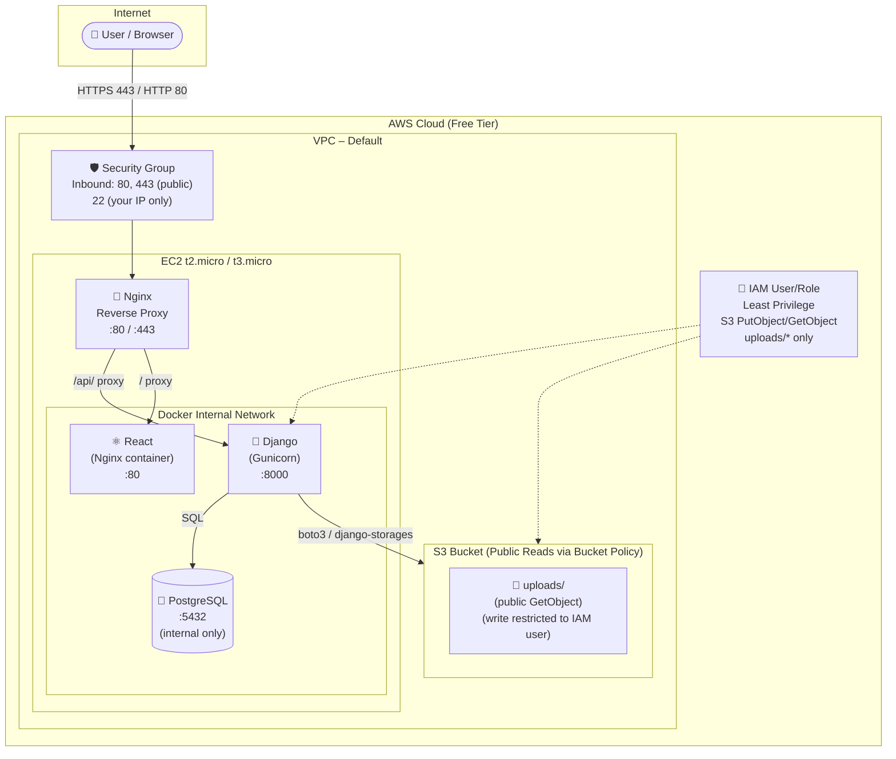

# Architecture Diagram – Notes App on AWS

## Data Flow

1. **User** makes HTTPS request → EC2 Security Group (allows 80/443)
2. **Nginx** reverse proxy routes:
   - `/api/*` → Django backend (port 8000)
   - `/admin/*` → Django admin (port 8000)
   - `/*` → React SPA (port 80 of frontend container)
3. **Django** queries **PostgreSQL** (internal Docker network only, port 5432 never exposed externally)
4. **File uploads** → Django writes to **S3** via `boto3`/`django-storages` using IAM credentials restricted to `uploads/*` prefix only
